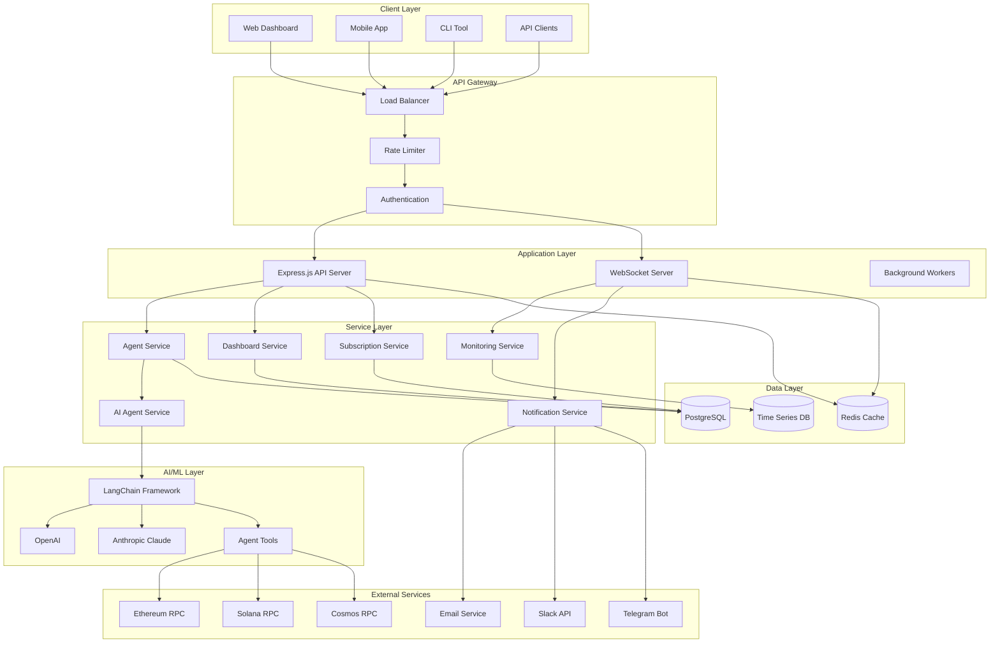
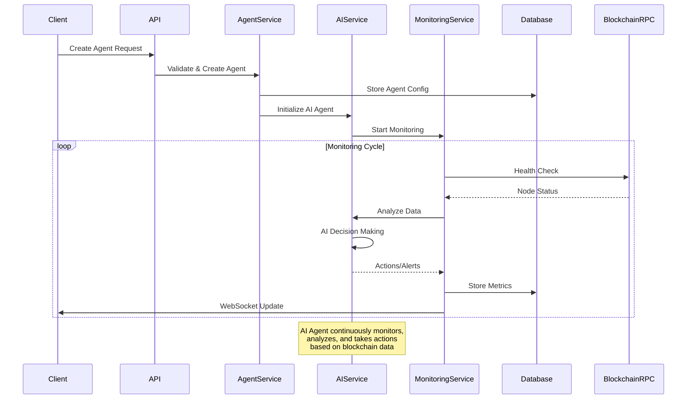
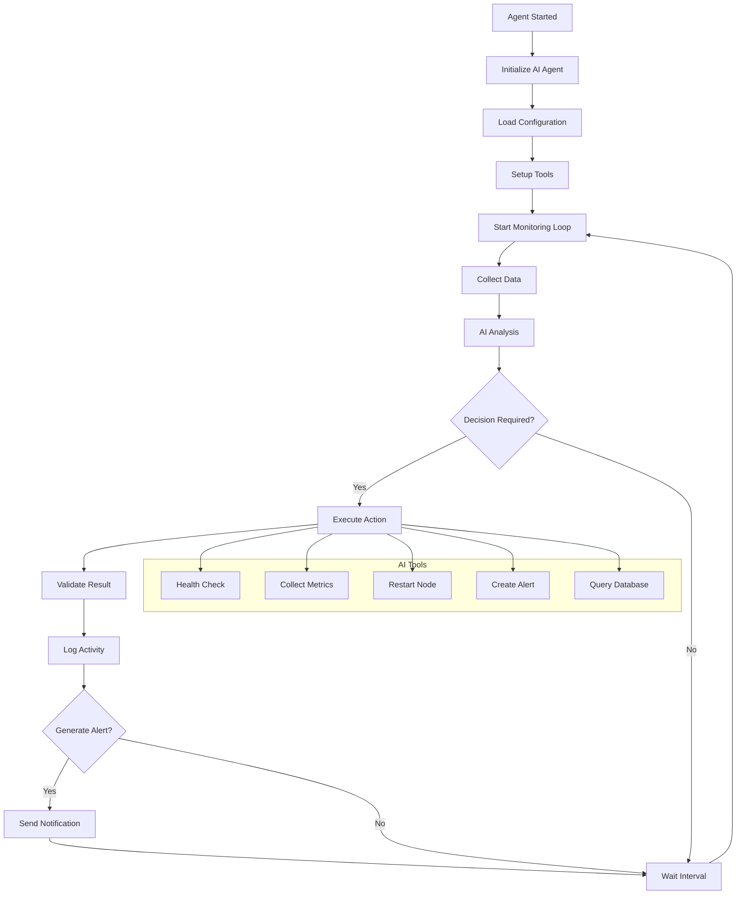
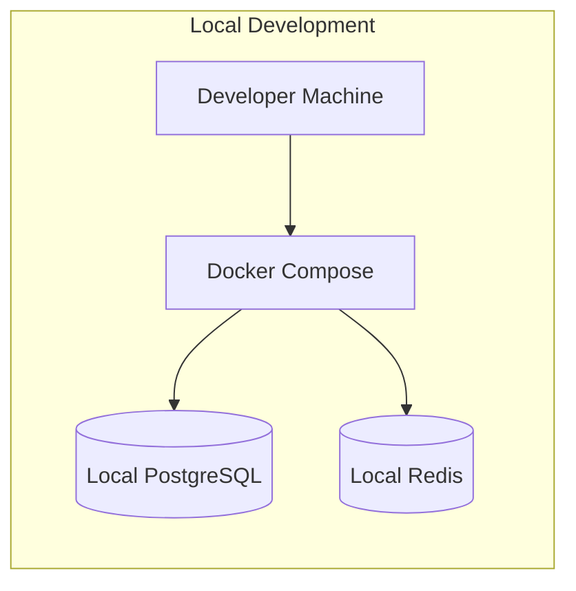
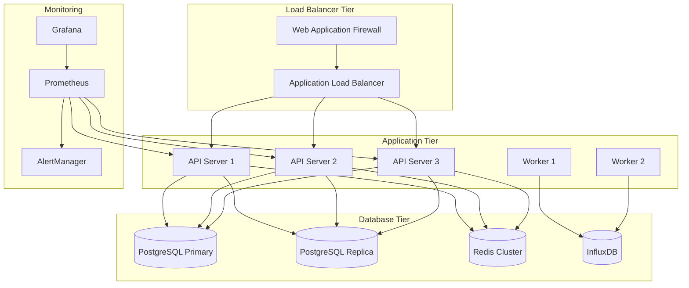
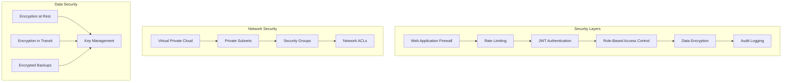
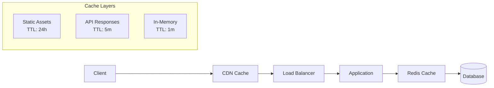

# Mentis Protocol System Architecture

This document provides a comprehensive overview of the Mentis Protocol system architecture, including service relationships, data flow, and deployment patterns.

## High-Level Architecture

## Service Architecture

### Core Services

#### 1. Agent Service
**Responsibility**: Manages AI agent lifecycle and configuration
- Agent CRUD operations
- Agent status management
- Configuration validation
- Task orchestration

#### 2. AI Agent Service
**Responsibility**: Handles AI-powered agent operations
- LangChain integration
- LLM provider management
- Tool execution
- Decision making workflows

#### 3. Monitoring Service
**Responsibility**: Real-time monitoring and metrics collection
- Node health monitoring
- Performance metrics
- Alert generation
- WebSocket event broadcasting

#### 4. Dashboard Service
**Responsibility**: Analytics and reporting
- Data aggregation
- Performance analytics
- Revenue tracking
- System health monitoring

#### 5. Subscription Service
**Responsibility**: Subscription and billing management
- Plan management
- Usage tracking
- Billing operations
- Access control

#### 6. Notification Service
**Responsibility**: Multi-channel notifications
- Alert routing
- Channel management
- Message formatting
- Delivery tracking

## Data Flow Architecture

## AI Agent Workflow

## Deployment Architecture

### Development Environment

### Production Environment

## Security Architecture

## Performance Optimization

### Caching Strategy

### Database Optimization
- **Indexing**: Strategic indexes on frequently queried columns
- **Partitioning**: Time-based partitioning for metrics tables
- **Connection Pooling**: Efficient database connection management
- **Query Optimization**: Optimized queries with EXPLAIN analysis

## Monitoring and Observability

### Metrics Collection
- **Application Metrics**: Response times, error rates, throughput
- **Infrastructure Metrics**: CPU, memory, disk, network
- **Business Metrics**: Agent count, subscription revenue, user activity
- **AI Metrics**: Model performance, token usage, decision accuracy

### Logging Strategy
- **Structured Logging**: JSON format with consistent fields
- **Log Levels**: DEBUG, INFO, WARN, ERROR, FATAL
- **Centralized Logging**: ELK stack or similar
- **Log Retention**: 30 days for application logs, 90 days for errors

### Alerting Rules
- **Critical**: System down, database unavailable
- **Warning**: High error rate, slow response times
- **Info**: Deployment notifications, scaling events

## Technology Stack Summary

| Layer | Technology | Purpose |
|-------|------------|---------|
| **Frontend** | React, TypeScript | Web dashboard |
| **API** | Node.js, Express.js | REST API server |
| **AI/ML** | LangChain, OpenAI, Anthropic | AI agent framework |
| **Database** | PostgreSQL, Redis | Data persistence and caching |
| **Monitoring** | Prometheus, Grafana | Metrics and visualization |
| **Queue** | Redis, Bull | Background job processing |
| **Blockchain** | Ethers.js, Solana Web3.js | Blockchain integration |
| **Deployment** | Docker, Kubernetes | Container orchestration |
| **CI/CD** | GitHub Actions | Automated deployment |
| **Security** | JWT, bcrypt, Helmet | Authentication and security |
